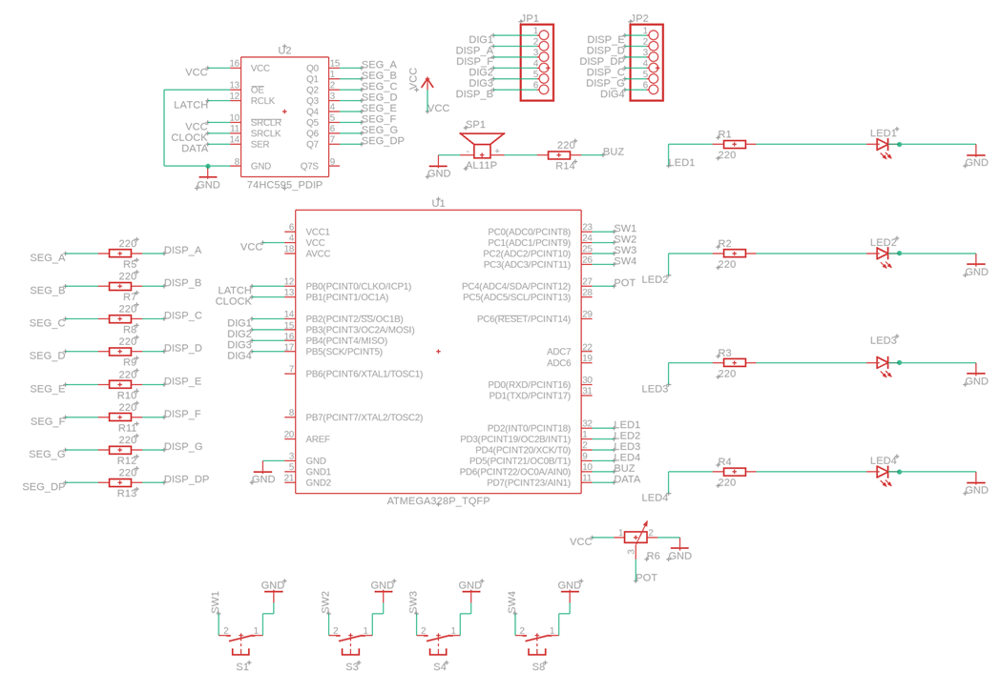

# Whack-a-LED

A reflex arcade game for ATmega328P (Arduino UNO), written in bare-metal C without the Arduino framework.

Player must press the arcade button whose LED lights up before the reaction window expires. Score scales with reaction speed; difficulty ramps up with progress. High score persists in EEPROM across reboots.

University project for **PM (Microprocessor Architectures)**, Faculty of Automatic Control and Computers - Alexandru-Nicolae Negru.

## Schematic



## Hardware

- Arduino UNO (ATmega328P @ 16 MHz)
- 4× arcade buttons with integrated LEDs
- 4-digit common-cathode 7-segment display (KH5461AB)
- 74HC595 shift register
- 10k ohms potentiometer (difficulty selector)
- Active buzzer
- 9× 220 ohms resistors

Full pinout is documented in the source comments and on the [project wiki](http://ocw.cs.pub.ro/courses/pm).

## Build & Flash

Requires `avr-gcc`, `avr-libc`, `avr-binutils`, and `avrdude`.

```bash
make            # compile -> whack.hex
make flash      # flash via avrdude (Arduino bootloader, default port /dev/ttyACM0)
make clean      # remove build artifacts
```

Override port if needed:

```bash
make flash PORT=/dev/ttyUSB0
```

## Features

- 3-state FSM (idle / playing / game over)
- 3-2-1-GO countdown at game start
- Proportional scoring (10 / 5 / 1 points based on reaction speed)
- Difficulty scaling: potentiometer + per-hit ramp
- Decimal-point timer bar (4 dots fading left-to-right)
- Slot-machine score animation on big hits
- Level-up announcement every 7 hits
- "GAnE OvEr" cycling message with Mario Death melody
- EEPROM-persisted high score, displayed as `HIGH` in idle
- Auto-return to idle after 5s of inactivity
- Special fanfare on new high score

## Binary size

`text: 4832 + data: 120 + bss: 30 = 4982 bytes` — about 15% of the 32 KB flash on ATmega328P.

## License

MIT
